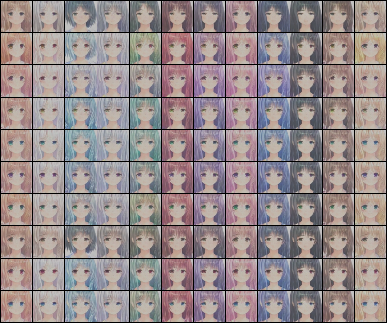
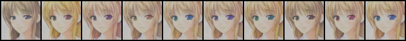
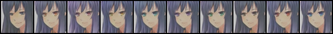
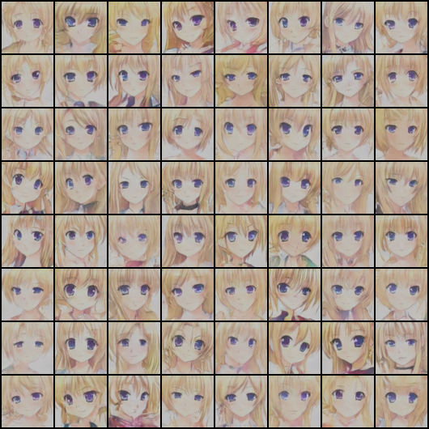
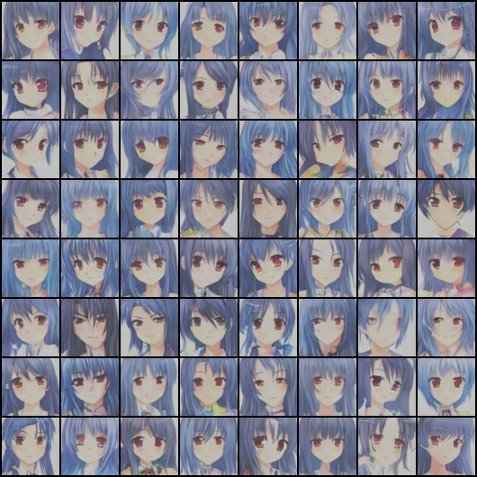
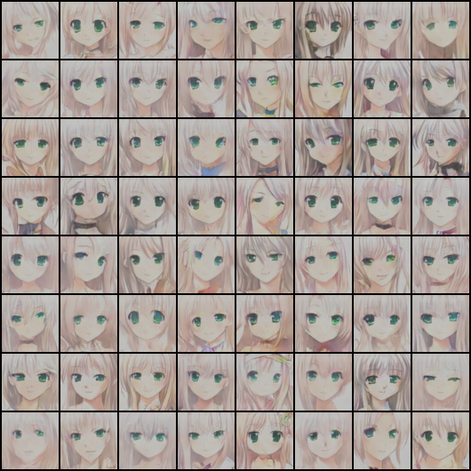

# Conditional GAN Anime Generation
Conditional Anime Generation using conditional GAN.

## Model and Objectives

Different from vanilla GAN, the generator and discriminator in conditional GAN (abbr. CGAN) will be given a specific condition (could be a one-hot vector indicating classes or a word-embedding).
***
The discriminator considers the following cases:  
1. Real distribution, correct conditon -> positive
2. Real distribution, wrong condition -> negative
3. Fake distribution, real condition -> negative
***
Our training process roughly follows the paper: https://arxiv.org/abs/1605.05396, only that the text descriptions are replaced with a one-hot class vector.

## Results
|Fixing noise|
|------------|
||

|Changing eye color|
|------------------|
||
||
||

|Change hair color|
|-----------------|
||
||
||

|Condition|Generated|
|---------|---------|
|blonde hair, purple eyes||
|blue hair, red eyes||
|white hair, green eyes||

